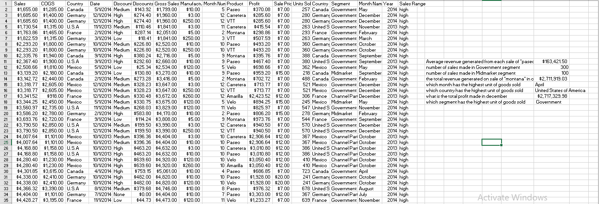

**FORMULAS FOR ARRIVING AT THOSE ANSWERS:**

-Average Revenue  =AVERAGEIF

-Number of Sales  =COUNTIF

-Total Revenue    =SUMIFS

-Month,Country and Segment  =VLOOKUP

-Total Profit     =SUMIFS

**INSIGHTS**

1. $163,421.50 Is the amount that was generated as an average revenue from the sale of "Paseo".

2. 300 Is the total amount of transaction that was made in government segment, and that is the segment with the most transaction.

3. Another segment is the midmarket segment, which has a total number of 100 transaction.

4. $2,711,919.03 Is the total revenue that was generated in Canada from the sale of "Montana".

5. Highest unit goods sold was done in the month of April.

6. United States of America is the country with the highest unit of goods sold.

7. $2,717,329.98 Is the tottal amount of profit that was made in the month of december.

8. Government segment is the segment with the highest unit of goods sold.

**RECOMMENDATION**

The average sale of "Paseo" which is $163,421.50 isnt totally bad but we can increase the those numbers by growing our geographic reach,
ie expanding physically and maybe online to a new location and equally investing heavily on advert. reevaluate our pricing plan, offer another 
new products and services to your customers and as well discounts. 
All this can equally be applied to the midmarket segment tha has low number of sale, and U.S.A as a country that has the highest number of sales
should maintain or improve its sales by having a good customer relationship, and making goods and services available at all time when needed by 
the customers and equally try to expand to American location that doesnt know about our products and services.
